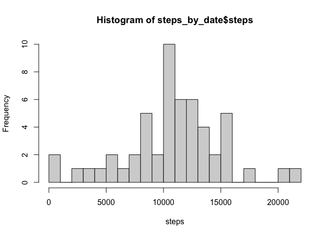
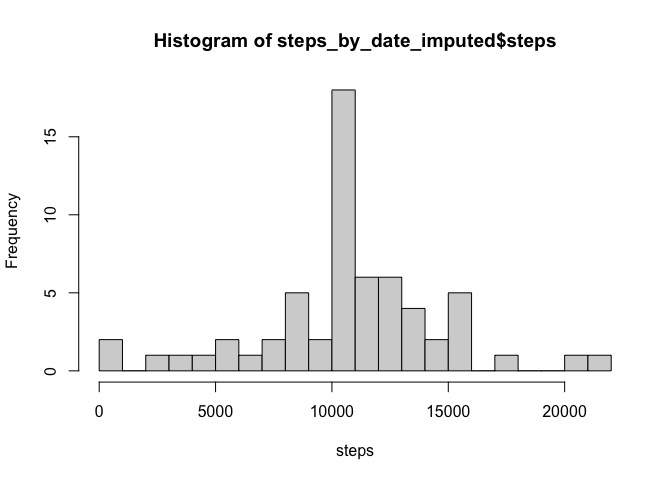
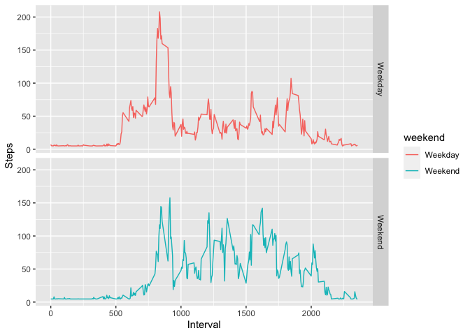

Rep\_Peer\_Assignment Week 2
============================

Question 1
----------

### Histogram Plot for number of steps per day

    library(dplyr)

    ## 
    ## Attaching package: 'dplyr'

    ## The following objects are masked from 'package:stats':
    ## 
    ##     filter, lag

    ## The following objects are masked from 'package:base':
    ## 
    ##     intersect, setdiff, setequal, union

    activity <- read.csv("activity.csv")
    steps_by_date <- activity %>%        ##Formatting the data to plot Histogram
                     group_by(date) %>%
                     summarise(steps =  sum(steps)) %>%
                     na.omit()

    ## `summarise()` ungrouping output (override with `.groups` argument)

     steps_by_date_hist <- hist(steps_by_date$steps, xlab = "steps",
                                breaks = 20)

     steps_by_date_hist

    ## $breaks
    ##  [1]     0  1000  2000  3000  4000  5000  6000  7000  8000  9000 10000 11000
    ## [13] 12000 13000 14000 15000 16000 17000 18000 19000 20000 21000 22000
    ## 
    ## $counts
    ##  [1]  2  0  1  1  1  2  1  2  5  2 10  6  6  4  2  5  0  1  0  0  1  1
    ## 
    ## $density
    ##  [1] 3.773585e-05 0.000000e+00 1.886792e-05 1.886792e-05 1.886792e-05
    ##  [6] 3.773585e-05 1.886792e-05 3.773585e-05 9.433962e-05 3.773585e-05
    ## [11] 1.886792e-04 1.132075e-04 1.132075e-04 7.547170e-05 3.773585e-05
    ## [16] 9.433962e-05 0.000000e+00 1.886792e-05 0.000000e+00 0.000000e+00
    ## [21] 1.886792e-05 1.886792e-05
    ## 
    ## $mids
    ##  [1]   500  1500  2500  3500  4500  5500  6500  7500  8500  9500 10500 11500
    ## [13] 12500 13500 14500 15500 16500 17500 18500 19500 20500 21500
    ## 
    ## $xname
    ## [1] "steps_by_date$steps"
    ## 
    ## $equidist
    ## [1] TRUE
    ## 
    ## attr(,"class")
    ## [1] "histogram"

### Mean and Median for the number of steps grouped by date

    raw_data_mean <- mean(steps_by_date$steps)

    raw_data_mean

    ## [1] 10766.19

    raw_data_median <- median(steps_by_date$steps)

    raw_data_median

    ## [1] 10765

Question 2
----------

### Grouping the data by the interval and producing a line plot

    library(ggplot2)
    steps_interval <- activity %>%
                      select(interval, steps) %>%
                      na.omit() %>%
                      group_by(interval) %>%
                      summarise(steps = mean(steps))

    ## `summarise()` ungrouping output (override with `.groups` argument)

    g <- ggplot(steps_interval, aes(interval, steps)) + geom_line()

    g

### Which 5 minute interval contains maximum number of steps

    max_steps_interval <- steps_interval[which(steps_interval$steps == max(steps_interval$steps)),]

    max_steps_interval

    ## # A tibble: 1 x 2
    ##   interval steps
    ##      <int> <dbl>
    ## 1      835  206.

Question 3
----------

### Calculating number of rows with missing values in original dataset

    sum(is.na(activity))

    ## [1] 2304

### Imputing the rows using the impute function from Hmisc Package

    library(Hmisc)

    ## Loading required package: lattice

    ## Loading required package: survival

    ## Loading required package: Formula

    ## 
    ## Attaching package: 'Hmisc'

    ## The following objects are masked from 'package:dplyr':
    ## 
    ##     src, summarize

    ## The following objects are masked from 'package:base':
    ## 
    ##     format.pval, units

    activity_imputed <- activity
    activity_imputed$steps <- impute(activity_imputed$steps, fun = mean)
    sum(is.na(activity_imputed))

    ## [1] 0

### Ploting a Histogram from imputed data

    steps_by_date_imputed <- activity_imputed %>% 
                     group_by(date) %>%
                     summarise(steps =  sum(steps)) %>%
                     na.omit()

    ## `summarise()` ungrouping output (override with `.groups` argument)

     steps_by_date_hist_imputed <- hist(steps_by_date_imputed$steps, xlab = "steps", breaks = 20)

     steps_by_date_hist_imputed

    ## $breaks
    ##  [1]     0  1000  2000  3000  4000  5000  6000  7000  8000  9000 10000 11000
    ## [13] 12000 13000 14000 15000 16000 17000 18000 19000 20000 21000 22000
    ## 
    ## $counts
    ##  [1]  2  0  1  1  1  2  1  2  5  2 18  6  6  4  2  5  0  1  0  0  1  1
    ## 
    ## $density
    ##  [1] 3.278689e-05 0.000000e+00 1.639344e-05 1.639344e-05 1.639344e-05
    ##  [6] 3.278689e-05 1.639344e-05 3.278689e-05 8.196721e-05 3.278689e-05
    ## [11] 2.950820e-04 9.836066e-05 9.836066e-05 6.557377e-05 3.278689e-05
    ## [16] 8.196721e-05 0.000000e+00 1.639344e-05 0.000000e+00 0.000000e+00
    ## [21] 1.639344e-05 1.639344e-05
    ## 
    ## $mids
    ##  [1]   500  1500  2500  3500  4500  5500  6500  7500  8500  9500 10500 11500
    ## [13] 12500 13500 14500 15500 16500 17500 18500 19500 20500 21500
    ## 
    ## $xname
    ## [1] "steps_by_date_imputed$steps"
    ## 
    ## $equidist
    ## [1] TRUE
    ## 
    ## attr(,"class")
    ## [1] "histogram"

### Comparing Mean and Median of imputed data with raw data

    print("Raw Data Mean :")

    ## [1] "Raw Data Mean :"

    raw_data_mean

    ## [1] 10766.19

    print("Imputed Data Mean :")

    ## [1] "Imputed Data Mean :"

    mean(steps_by_date_imputed$steps)

    ## [1] 10766.19

    print("Raw Data Median :")

    ## [1] "Raw Data Median :"

    raw_data_median

    ## [1] 10765

    print("Imputed Data median :")

    ## [1] "Imputed Data median :"

    median(steps_by_date_imputed$steps)

    ## [1] 10766.19

Question 4
----------

### Separating the data into weekend and week days

    activity_imputed$date <- as.Date(as.character(activity_imputed$date))
    activity_imputed$weekday <- weekdays(activity_imputed$date)
    activity_imputed$weekend <- ifelse(activity_imputed$weekday=="Saturday" | activity_imputed$weekday=="Sunday", "Weekend", "Weekday" )
    head(activity_imputed)

    ##     steps       date interval weekday weekend
    ## 1 37.3826 2012-10-01        0  Monday Weekday
    ## 2 37.3826 2012-10-01        5  Monday Weekday
    ## 3 37.3826 2012-10-01       10  Monday Weekday
    ## 4 37.3826 2012-10-01       15  Monday Weekday
    ## 5 37.3826 2012-10-01       20  Monday Weekday
    ## 6 37.3826 2012-10-01       25  Monday Weekday

### Subsetting the data set by weekend and steps

    activity_imputed_subset <- aggregate(activity_imputed$steps , by= list(activity_imputed$weekend, activity_imputed$interval), na.omit(mean))

    names(activity_imputed_subset) <- c("weekend", "interval", "steps")

    head(activity_imputed_subset)

    ##   weekend interval    steps
    ## 1 Weekday        0 7.006569
    ## 2 Weekend        0 4.672825
    ## 3 Weekday        5 5.384347
    ## 4 Weekend        5 4.672825
    ## 5 Weekday       10 5.139902
    ## 6 Weekend       10 4.672825

### Plotting a panel plot to differentiate between Weekend and Weekdays

    g2 <- ggplot(activity_imputed_subset, aes(interval, steps, color = weekend)) + geom_line() + facet_grid(weekend~.) + xlab("Interval") + ylab("Steps")

    g2

